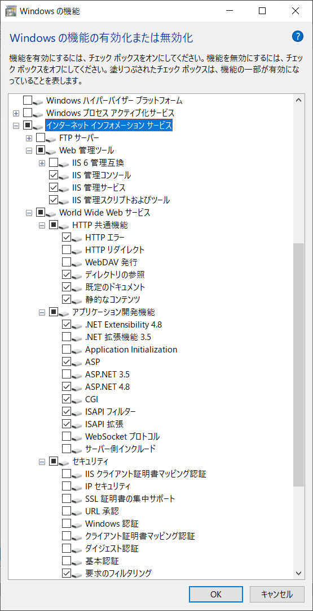
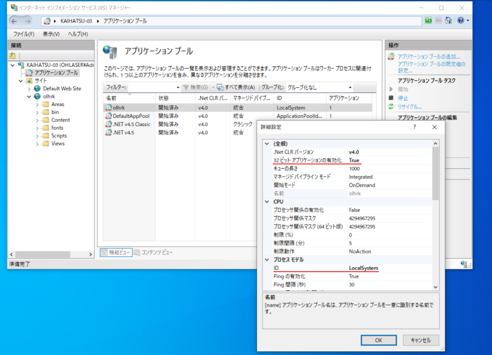

# HARUKA外部操作Webアプリケーション
olhrk_webはC#で記述された ASP.NET Webアプリケーションです。HARUKAに対して状態取得、加工データの準備といった操作を遠隔PCから行えます。
HARUKAが動作しているWindowsでIISを起動して使用します。httpプロトコルを通じて、HARUKAの状態取得、データ転送を行うことができます。
※このリポジトリ単体をクローンしても使用できません。[olexttool](https://github.com/OHLASER/olexttool) からサブモジュールとして本リポジトリを取得してください。

## IISの設定
olhrk_webを使用する際に必要な、IISの各種設定について記載します。

### Windowsの機能
<!--IISに関するwindowsの機能の設定について、以下のような設定で動作を確認しています。 
 
<br-->
本アプリの動作にはIISのインストールが必要になります。
必要となるWindowsの各種機能はinstall_iis.ps1を実行することで一括で有効化できます。有効化される機能は以下の通りです。
- IIS-ManagementConsole
- IIS-ManagementService
- IIS-ManagementScriptingTools
- IIS-NetFxExtensibility45
- IIS-ASP
- IIS-ASPNET45
- IIS-CGI
- IIS-ISAPIExtensions
- IIS-ISAPIFilter
- IIS-DefaultDocument
- IIS-DirectoryBrowsing
- IIS-HttpErrors
- IIS-StaticContent
- IIS-RequestFiltering
 
 

### IISマネージャ
olhrk_webを使用するサイトに紐づくアプリケーションプールの詳細設定画面上で、以下のように項目設定が行われている必要があります。
|  項目  |  説明  |
| ---- | ---- |
|  32ビットアプリケーションの有効化  | True  |
|  ID  | LocalSystem  |

### その他
IPアドレス、ポートの設定値については、HARUKAはそれらを参照しないため任意の値で問題ありません。
